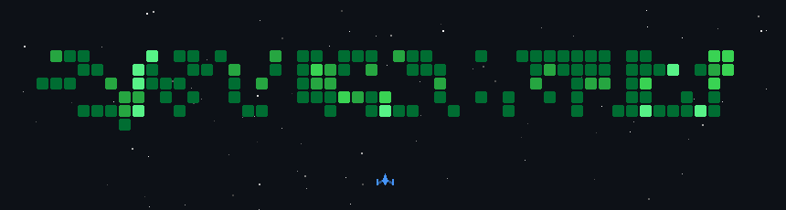

  <ul align="center" style="list-style: none">
    

      <h1>
        👋 Hi, I'm Rich
      </h1>
    

  </ul>

**<h3 align="center">🔗 Connect with me:</h3>** 

   

 **<h3 align="center">🚀 Passionate frontend / full stack developer, building robust and scalable web applications with a strong foundation in network infrastructure. Comfortable across the stack, from structured cabling to production Next.js platforms.</h3>**

**<h3 align="left">Rapid Fire</h3>**

- 💼 I'm currently working on: **💻 Building and maintaining production web platforms with Next.js, React, and custom admin panels**
- 🌱 I'm currently learning: **📚 Always picking up something new — one technology at a time, always leveling up**
- 💬 Ask me about: **💡 JavaScript, React, Next.js, Node.js, PHP, MySQL/PostgreSQL/MongoDB, network infrastructure, keyboards, mice, and PC builds**
- ⚽ **Football fan**
- 🗣️ Languages: **Spanish (native), English**

 **<h3 align="center">🛠️ Skills</h3>**

  

**<h3 align="center">📊 GitHub Stats</h3>**

   
   
  

**<h3 align="center">🚀 GitHub Activity</h3>**

  

